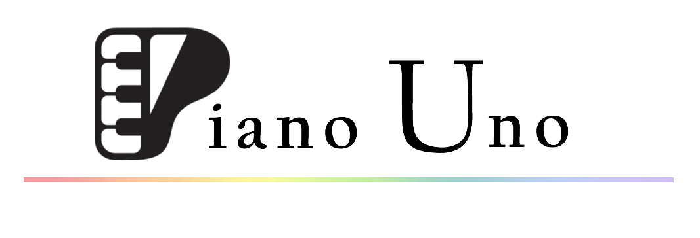

# Team E Name : Nice For What

Team Members : 
| |  |
|--|--|
|  [Billy CHHUON](https://github.com/BillyChhuon)   Co-founder of Piano Uno| [Pauline TRUONG ](https://github.com/paulinetruong)   Co-founder of Piano Uno

  

# Project Name : Piano Uno

 **Description** : Piano Uno is a small piano that will work with an Arduino Uno. Basically, it's like a piano so you can play a song by pressing the different keys on the keyboard and it will produce a sound. Moreover, under the keyboard we will have some LEDs that will light up for each key pressed.
 
[Click here for more information about the project](project) 

# Lab Reports

You can check the different labs on [this link](lab).

