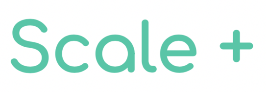

# Team E Name : Nice For What

Team Members : 
| |  |
|--|--|
|  [Billy CHHUON](https://github.com/BillyChhuon)   Co-founder of Scale+| [Pauline TRUONG ](https://github.com/paulinetruong)   Co-founder of Scale+

  

# Project Name : Scale +

**Scale+** is about determining the weight of people and provide them with daily support. The scale will send data to the IoT dashboard - ThingSpeak - for future analysis. The scale is also able to measure the weight of multiple person.

 **Description** 
 
[Click here for more information about the project](project) 

# Lab Reports

You can check the different labs on [this link](lab).

