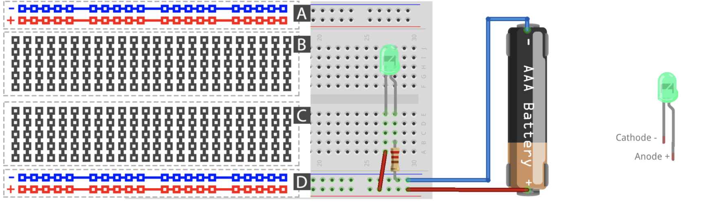
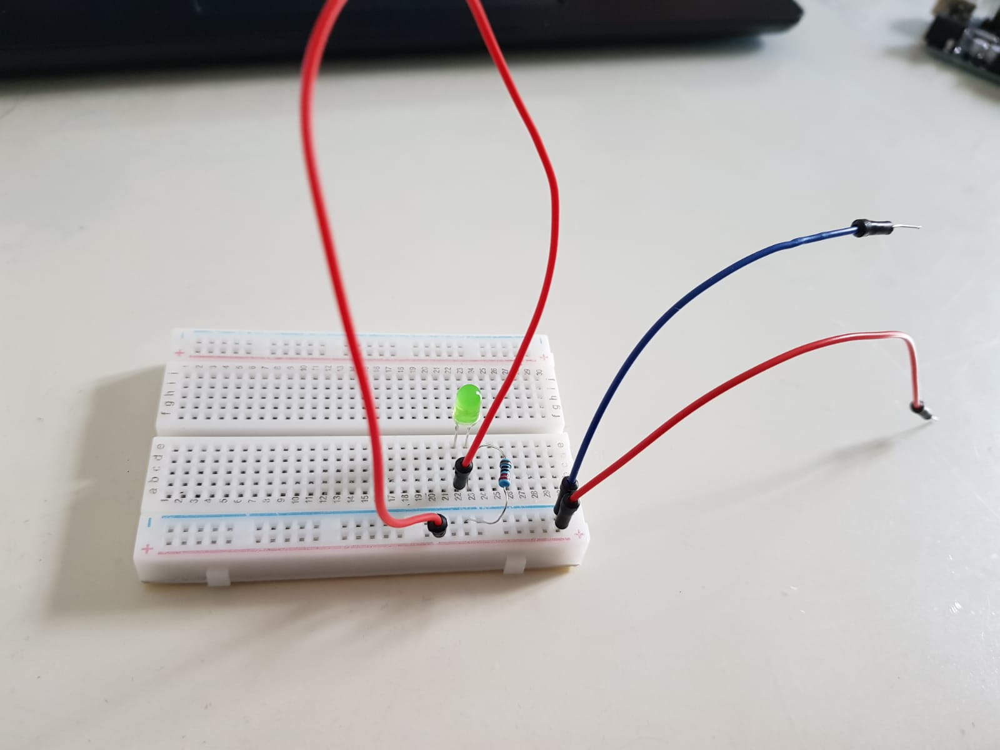
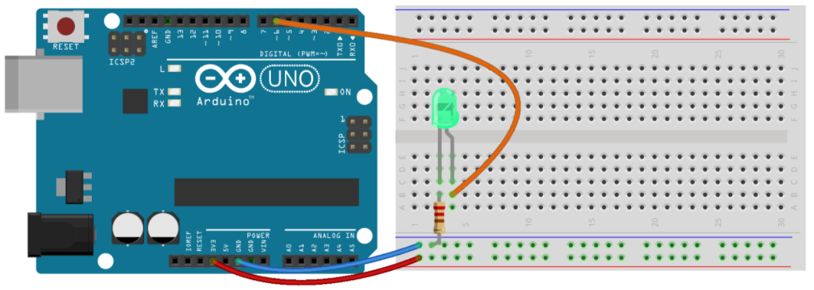
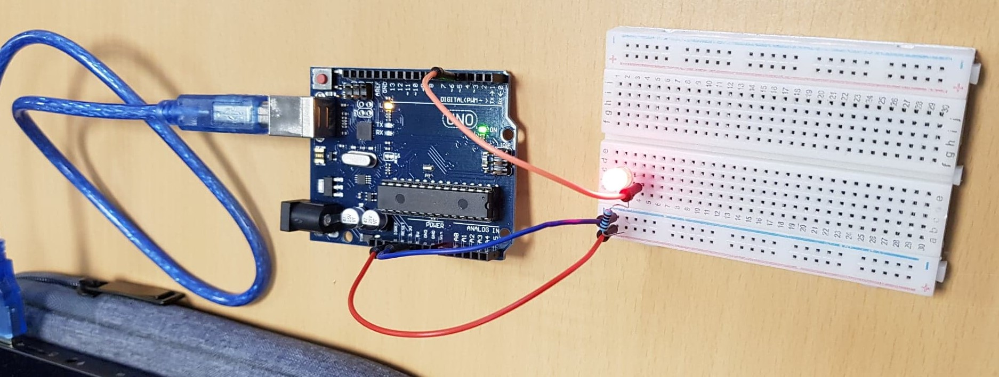

# Step 1 : Turning on/off an LED 

To get started with the materials we worked with a breadboard. The objective here is to turn on an LED with a battery. So, we realize this figure shown below : 

Here is the representation of the schema above : 

Unfortunately we did not have the proper battery to test it out. So we moved on the step number 2.

# Step 2 : Turning on/off an LED with a micro-controller

Same goal as step 1 but this time with a micro-controller. In this lab we use an Arduino UNO development board.
To turn on an LED, we realise the following figure :

## Schematic

 

# **Exercise 1** : Test your LED by connecting the orange wire to the red bus (VCC)

Modelisation of the figure during the first lab session

## Board Image 

As you can see, the LED is on.
 

## Step 3 : Upload a program to the Arduino

We downloaded Arduino IDE.

