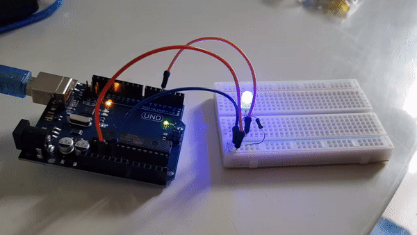

# Step 4 : Details

## **Exercise 2** : Turn on and off an LED in port 4

In this second exercise, we will use the software that we downloaded in the Step 3 : Arduino IDE.

The goal of the exercise is to discover Arduino programming and how it communicate with the micro-controller. Here we want to turn on and off an LED with this following program :


## Code

 ```
void setup()
{
    pinMode(4, OUTPUT);    // set digital pin 4 as OUTPUT
}

void loop()
{
    digitalWrite(4, HIGH); // light on
    delay(500);            // for 0.5 seconds
    digitalWrite(4, LOW);  // light off
    delay(500);            // for 0.5 seconds
}
```
  
## Board Image

