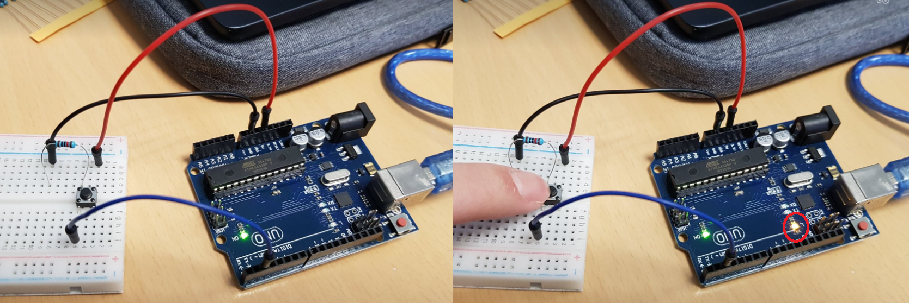

# Step 5 : Read a digital value

In the step 5 we have to model this figure with a button.

## Schematic 


<br>

## **Exercise 3** : Create a program that light up an LED when you press a button, and test it
<br>

## Code

```
const int led = 13;
int buttonPin=2;
int buttonState=0;
 
void setup() {
  pinMode(buttonPin, INPUT);
  pinMode(led, OUTPUT);
}
 
void loop() {
  buttonState = digitalRead(buttonPin);  // turn the LED on
  if (buttonState == HIGH)
{
    digitalWrite(led, HIGH);
}
  else
{
    digitalWrite(led, LOW);
}
}
```

## Board Image 




While executing the program, when you press the button, the built-in LED lights up, when you release the button, the built-in LED is extinguished.