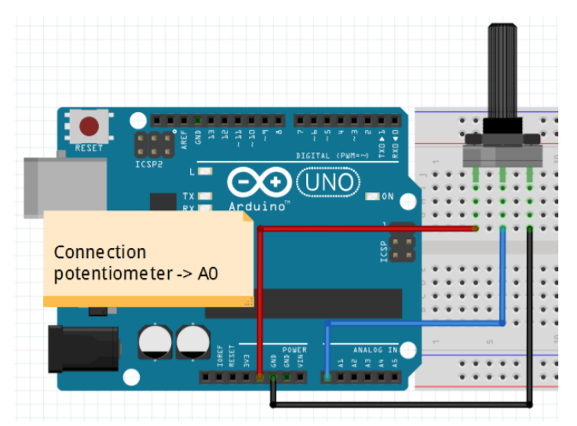

# Step 6 : Read an analogue value

In the step 6 we want to read an analogue value using a potentiometer. To do so, we realise this figure below :

## Schematic


## **Exercise 4** :

## Code
```
const int potentialPin = 0;
const int led = 13; 
int value = 0; 

void setup() {

pinMode(led, OUTPUT); 
pinMode(potentialPin, INPUT);

}
void loop() {

  value = analogRead(potentialPin); //  read the state of the potentiometer
  
  digitalWrite(led, HIGH); // light on
  delay(value);            // for 'value' seconds
  digitalWrite(led, LOW);  // light off
  delay(value);            // for 'value' seconds

}
```


In this exercise, we used a potentiometer to change the delay between each blink of the LED.
In this video, while executing the program, we can see that the more we turn the potentiometer, the shorter the delay between each blink is. 