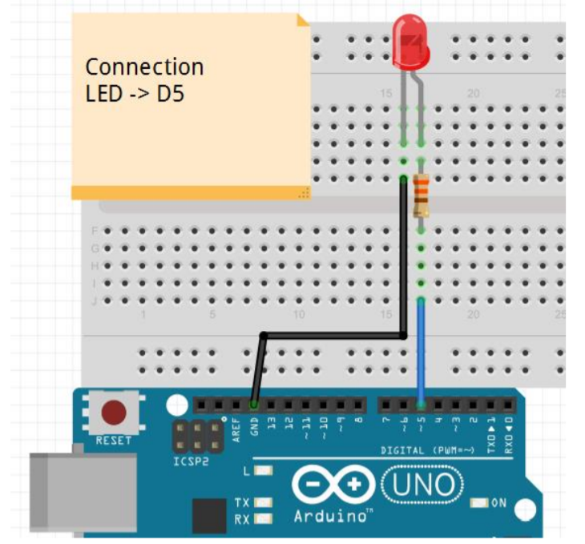
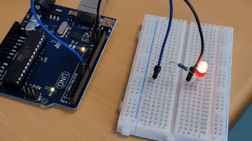

# Step 7 : Write an analogue value

## **Exercise 5** : Fading effect

In this exercise we want to create a breathing effect for our LED. So first, let's reproduce the figure below :

## Schematic


Then, we implement the following program in Arduino IDE in order to make the fading effect :
<br>

## Code

```
int ledPin = 5;

void setup() {

  // nothing happens in setup
}

void loop() {

  // fade in from min to max in increments of 5 points:

  for (int fadeValue = 0 ; fadeValue <= 255; fadeValue += 5) {
    // sets the value (range from 0 to 255):

    analogWrite(ledPin, fadeValue);

    // wait for 30 milliseconds to see the dimming effect

    delay(30);

  }

  // fade out from max to min in increments of 5 points:

  for (int fadeValue = 255 ; fadeValue >= 0; fadeValue -= 5) {

    // sets the value (range from 0 to 255):

    analogWrite(ledPin, fadeValue);

    // wait for 30 milliseconds to see the dimming effect

    delay(30);

  }
}
```

Lastly, this is the setup that we did, using both the schema and code above.
<br>

## Board Image


As you can observe, the LED produces a fading effect.