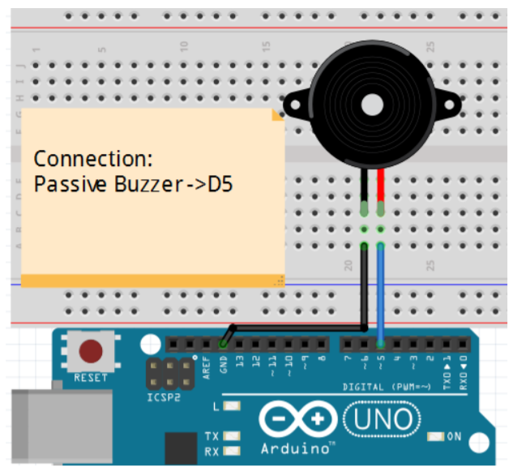

# Step 8 : Buzzer

## **Exercise 6**: 

For the step 8, we want to explore the passive buzzer sound.
The figure shown below is the schema to test the passive buzzer :

## Schematic 



Then, the associated program to test the passive buzzer is as follow :

## Code
```
const int buzzer = 5; //buzzer to arduino pin 5


void setup(){
 
  pinMode(buzzer, OUTPUT); // Set buzzer pin 5 as an output
}

void loop(){
 
  tone(buzzer, 400);    // Send 400Hz sound signal
  delay(500);        
  noTone(buzzer);     // Stop sound
  delay(500); 
  tone(buzzer, 100);  // Send 100Hz sound signal
  delay(500); 
}
```

We tested this program, so first, we have a sound of 400Hz, then it stops, then we hear another sound of 100Hz and it repeats.