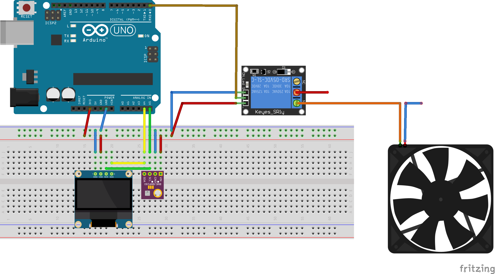

# Step 1

## **Exercise 3 :**

In the schema represented below we can see an Arduino Uno connected to a LCD and a BMP280 sensor and relay. 

Normally, we had to do this performance in real life, but due to a lack of material we did not have the necessary components. 
That's why we used Fritzing design software to represent it.

 

## Fritzing 

- Download Fritzing
- Create a new **sketch** 
- For the wires, we use red color for **VCC** and blue color for **GROUND**

Here is the sketch that represents communication with the I2C device. 

