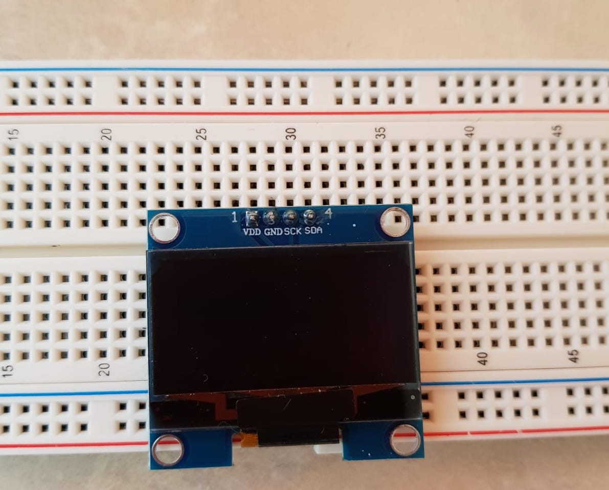

# Lab 3 

## **Introduction** 

 
The thrid lab of Internet of Things was about discovering and manipulating OLED component. 
 
 

- What is OLED ? 

> Oled stands for Organic Light-Emitting Diode

OLED is an electronic component that produces light. OLED technology is used for display in the field of flat screens. Indeed, it has a better color rendering with a very deep black. We can also notice that the component is quite thin and light. 

## **Board Image**
> Here is a photograph of the OLED component 

  
## **Exercises**
  - [Exercise 1](ex1)
  - [Exercise 2](ex2)
  - [Exercise 3](ex3)

  

# **Issues**

- In this lab, the main issue we encoutered is the library. In fact, we lost a lot of time solving this problem. 
- In the meantime, we moved to the lab 4. However, from the first moment of lab 4 we needed our lab 3 achievements and codes in order to continue to work on it. 
- This caused a lot of jumps on the labs and we had to take a step back not to get lost.
- Finally, we managed to find a library that worked and that allowed us to make both labs correctly.

 

 # **Conclusion**

 The third lab of IoT allowed us to discover more about the OLED component. We found it funny to realize this lab because at the end, we could use the code to display on the OLED screen what we wanted and also to put pictures, which impressed us.  

