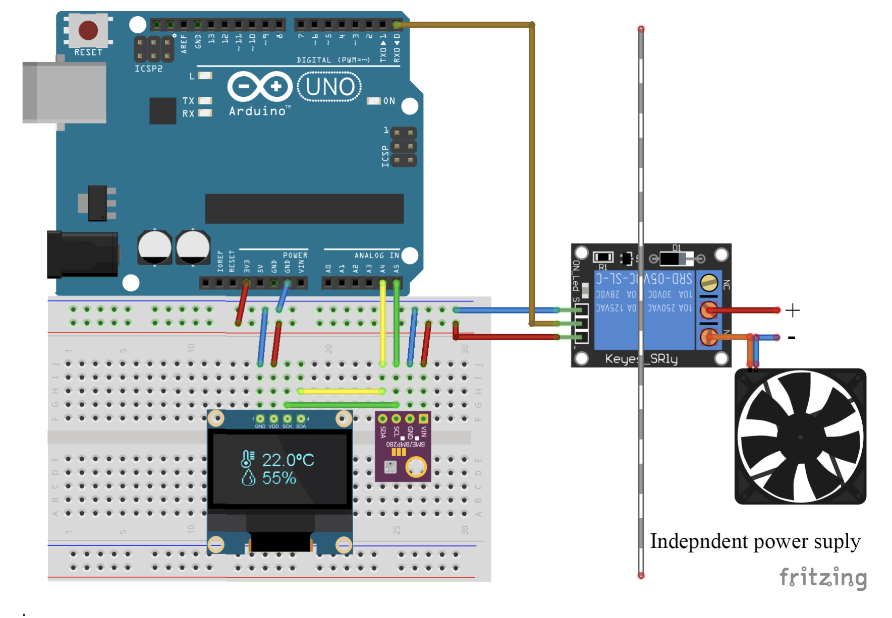
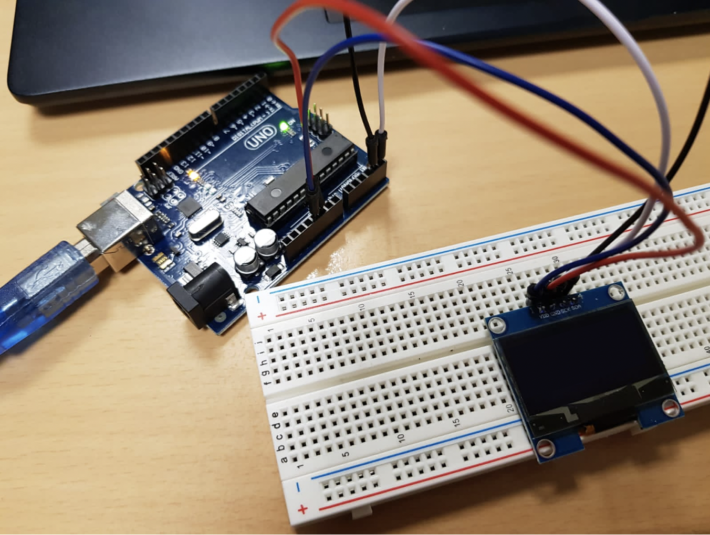
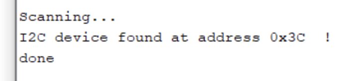

# Step 1 : Importing Library

In this first step, we will discover how to add a library on Arduino IDE. To do that, we will follow the link given in the subject in order to install Adafruit library. 

When this step is done, we will move to the step 2 

# Step 2 : OLED Implementation

The goal here is to implement the OLED Display using the schematic given in the Lab 2. Last time, we couldn't manually realize this schematic because we didn't have all the necessary components. 

## **Schematic**

So we were able to connect Arduino Uno with the OLED with some wires as you can see below : 

## **Board Image**

# Step 3 : Find I2C devices

## **Exercice 1 :**
 

This first exercise was about to get the I2C communication working. Using the link given in the subject, we were able to upload the sketch to the Arduino IDE and open the serial monitor. If the connection works, the device on the I2C-bus is reported as follow :

## **Output of the serial motor** 
