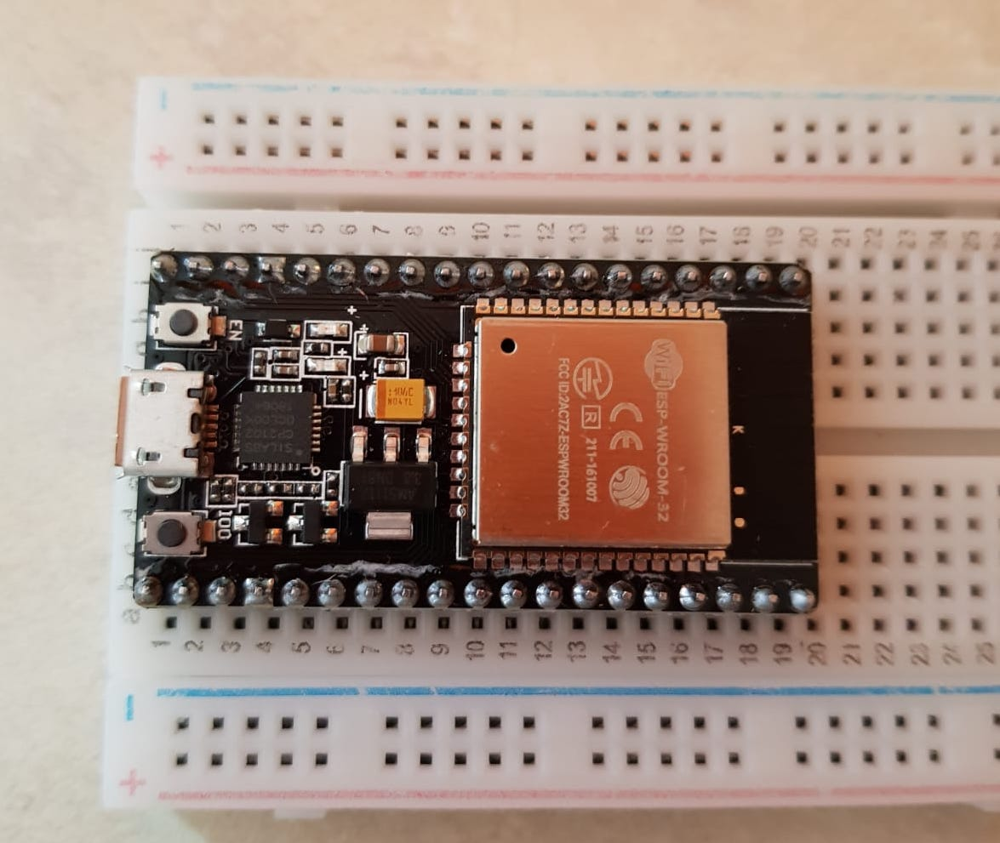

# Step 1 : Installing ESP32 Add-on in Arduino IDE

In this first step, we will discover how to install ESP32 board in Arduino IDE. To do that, we will follow the link given in the subject in order to do that.

When this step is done, we will move to the step 2

<br>

# Step 2 : Find ESP32 chipset   
Here is a picture of the ESP32 component 



# Step 3 : Upload blinking LED code

In this exercise, we want to use the schematic we saw in the Lab 1 to blink a LED but instead of using Arduino Uno, we will use ESP32. 

Here is the code and the board image of our work. 

## **Code**

``` 
const int LED_BUILTIN = 12;
void setup() {
pinMode (LED_BUILTIN, OUTPUT);
}
void loop() {
digitalWrite(LED_BUILTIN, HIGH);
delay(1000);
digitalWrite(LED_BUILTIN, LOW);
delay(1000);
}

``` 

## **Board Image**

