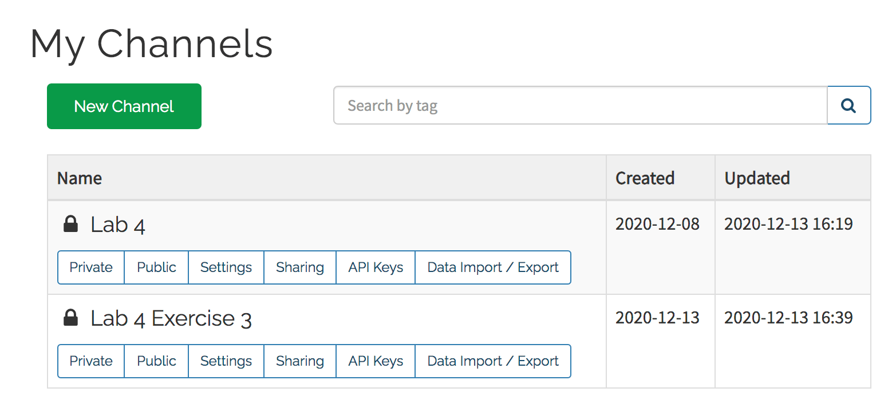
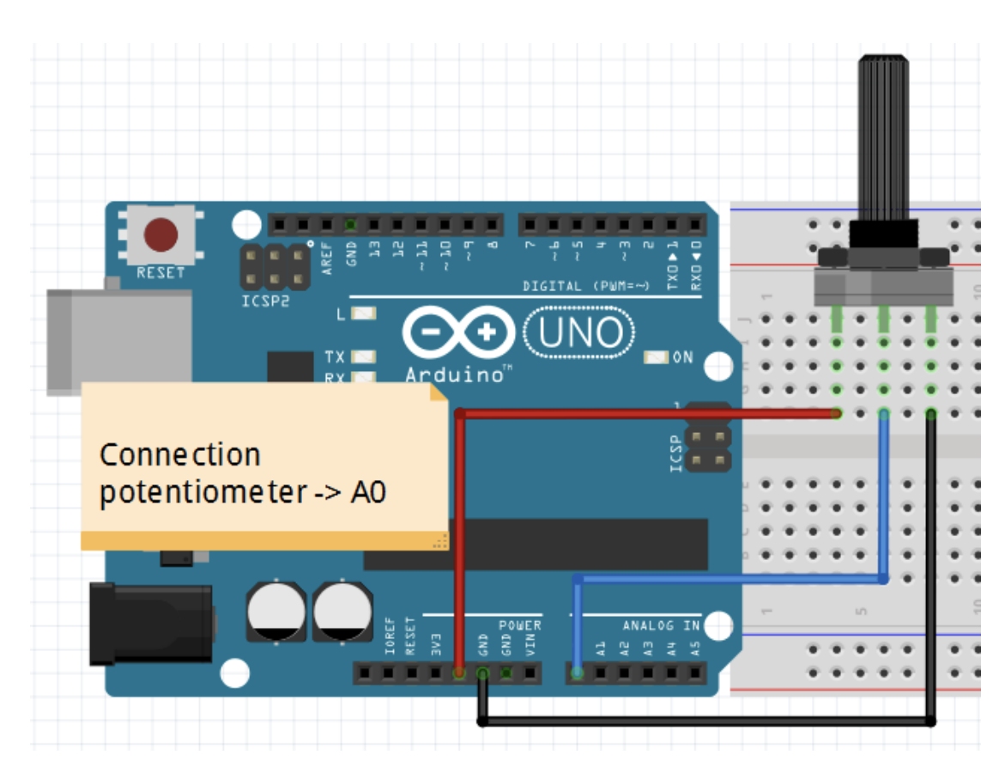
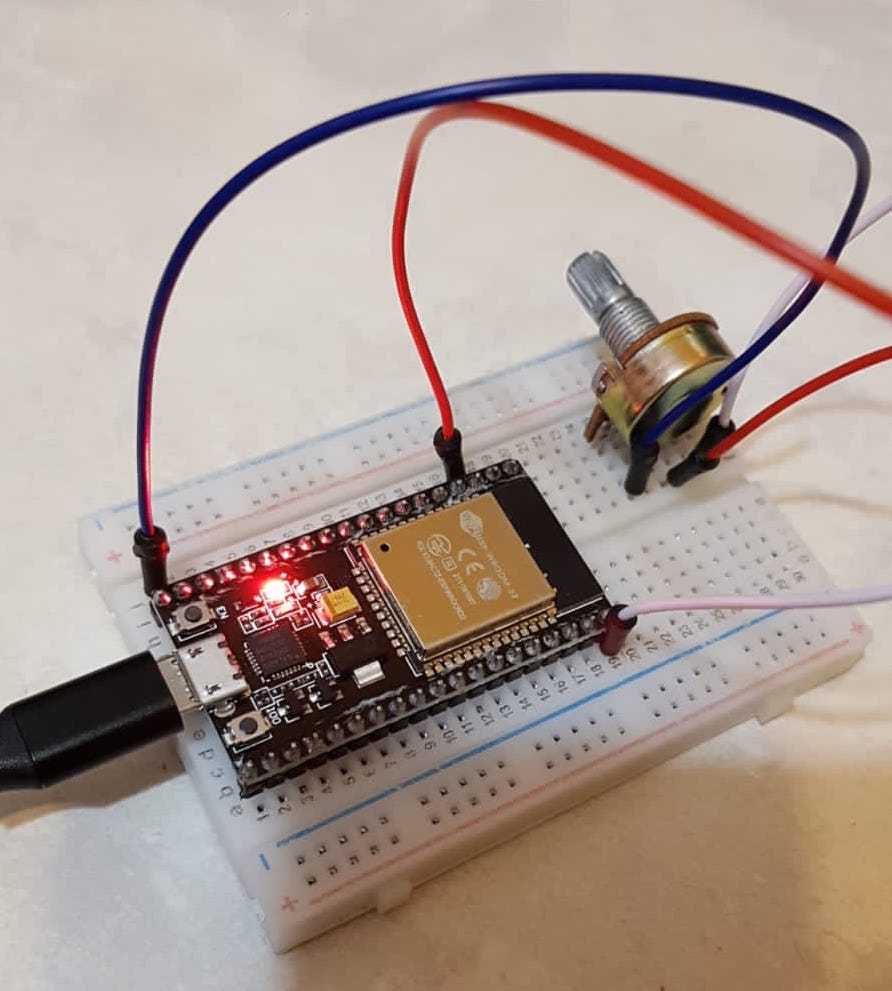
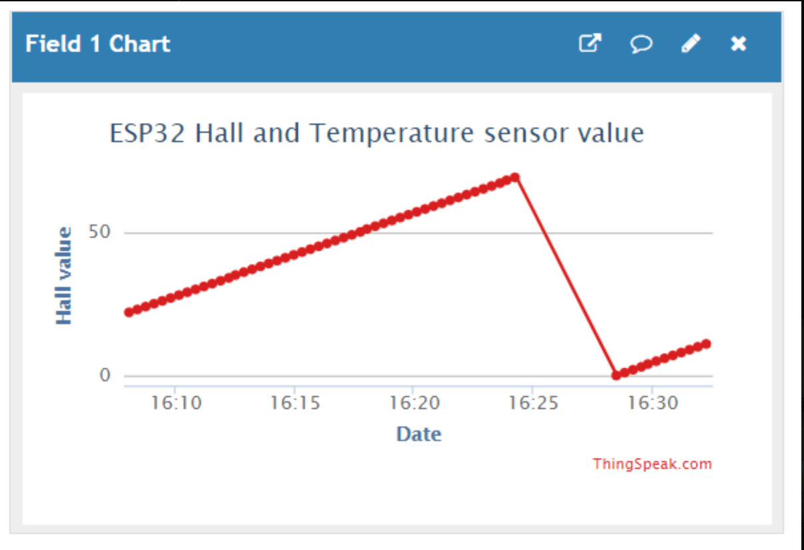
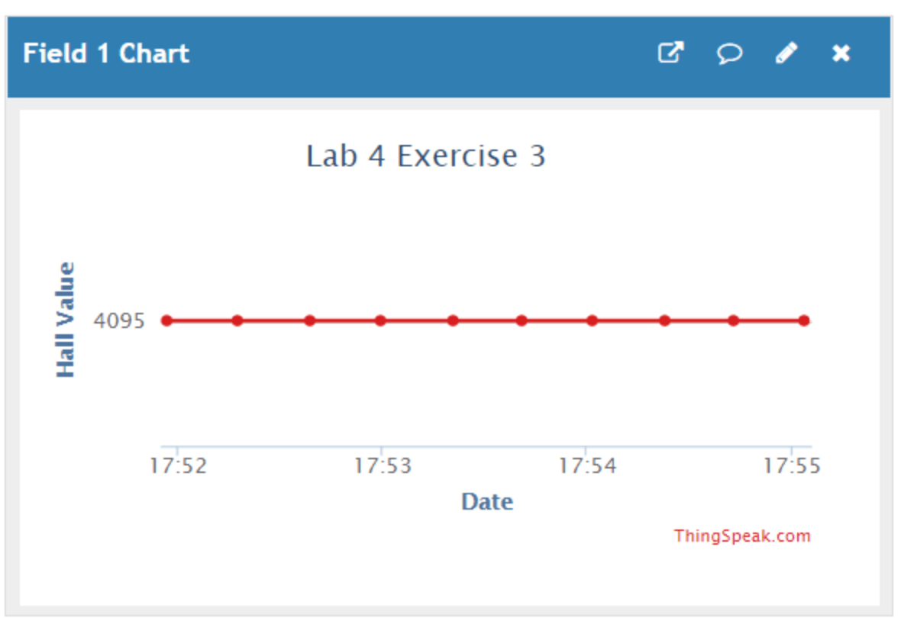
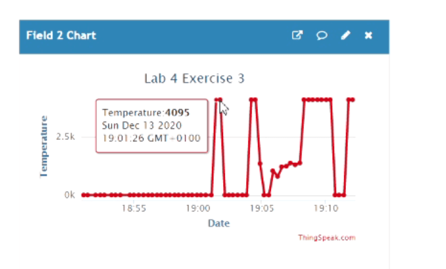

# Step 5 : Thingspeak platform

Thingspeak is a web service to record data, over the internet. 
 



<br>

## **Exercise 3 :**

To realize this exercise, we will need the build circuit of the step 6 in the Lab 1. 

Remember, the goal was to **read an analogue value** using a **potentiometer**, of an Arduino board. 

We will use the following schematic : 

<br>

## **Schematic :**



The objectif here is to send its data to thingspeak dashboard. Data will be exchanged using **ESP32** and its **wifi** functionality.

To do so, we must create an account and a private channel in ThingSpeak. From there, we were able to recover our channel number and channel API Key.

We will then use a private wifi connection from our phone. We retrieve the device name with the associated password.

All these elements, we will add it in the secrets.h part of the WriteSingleField code. 

<br>

## **Code** 

Here is the code we used to connect ESP32 device with ThingSpeak software. 
We decided to chose the WriteSingleField code because it send a **single analogue value**.

- Write Single Code

We obtain the code by following this path :
<br>


> `File` -> `Examples` -> `ThingSpeak` -> `ESP32` -> `WriteSingleField`

``` 
#include "ThingSpeak.h"
#include "secrets.h"
#include <WiFi.h>

char ssid[] = SECRET_SSID;   // your network SSID (name) 
char pass[] = SECRET_PASS;   // your network password
int keyIndex = 0;            // your network key Index number (needed only for WEP)
WiFiClient  client;

unsigned long myChannelNumber = SECRET_CH_ID;
const char * myWriteAPIKey = SECRET_WRITE_APIKEY;

int number = 0;

void setup() {
 Serial.begin(115200);  //Initialize serial

 WiFi.mode(WIFI_STA);
 ThingSpeak.begin(client);  // Initialize ThingSpeak
}
int Pin = 39;

void loop() {

 // Connect or reconnect to WiFi
 if(WiFi.status() != WL_CONNECTED){
   Serial.print("Attempting to connect to SSID: ");
   Serial.println(SECRET_SSID);
   while(WiFi.status() != WL_CONNECTED){
     WiFi.begin(ssid, pass); // Connect to WPA/WPA2 network. Change this line if using open or WEP network
     Serial.print(".");
     delay(5000);
   } 
   Serial.println("\nConnected.");
 }

 number= analogRead(Pin);
 // Write to ThingSpeak. There are up to 8 fields in a channel, allowing you to store up to 8 different
 // pieces of information in a channel.  Here, we write to field 1.
 int x = ThingSpeak.writeField(myChannelNumber, 2, number, myWriteAPIKey);
 if(x == 200){
   Serial.println("Channel update successful.");
 }
 else{
   Serial.println("Problem updating channel. HTTP error code " + String(x));
 }
 
 delay(20000); // Wait 20 seconds to update the channel again
}

``` 

<br>


- Secrets.h code 

In this part of the code, we will replace the name of our WiFi networ and its password. We will define our channel number and API Key. 

``` 
secrets.h
#define SECRET_SSID "Billy"        // replace MySSID with your WiFi network name
#define SECRET_PASS "billy123"    // replace MyPassword with your WiFi password

#define SECRET_CH_ID 1252099            // replace 0000000 with your channel number
#define SECRET_WRITE_APIKEY "P0CLQGNW8LVSLLL0"   // replace XYZ with your channel write API Key

``` 

## **Board Image**
<br>


<br>

<br>

## **Dashboard Image** 
<br>

1. At the first time, our curve was only increasing and when we tried to bring it down by turning the potentiometer, the curve didn't move.
When we reset the esp32, the value decrease automatically as you can see on the picture.



<br>


2. Then, we thought that it was a problem with the connections. So we change some wires position



<br>


3. Finally we found our mistake and get the right implementation. The value on the curve varies as required whether our potentiometer is turning or not.




The aim of the exercise is to use the potentiometer by turning it and changing its values.
The value will be retrieved in the ThingSpeak graph as we can see in avobe.
The connection was well made by the ESP32 thanks to its wifi functionality.